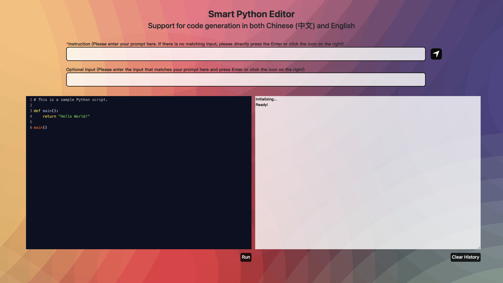

# smart_python_editor
We create a service that integrates LLM for code generation. For aesthetics, we use the CodeMirror component, and the LLM
for code generation is self-developed by us. For more details, you can get from HuggingFace: [frankminors123/Chinese-CodeLlama-7B-SFT-V2](https://huggingface.co/frankminors123/Chinese-CodeLlama-7B-SFT-V2).

Start LLM HTTP interface service, and it is recommended to use Google to access html. You can see the following window:

    

Play and enjoy it!